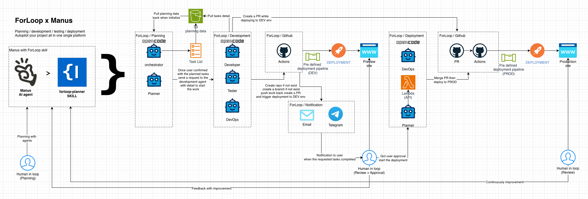

<div align="center">

## ForLoop Manus Skill


A Manus-native Skill that teaches Manus to operate as the **ForLoop Planner** — a planning-only agent that follows the ForLoop planning lifecycle and uses the `forloop` CLI as its primary execution interface.

> **Repo:** [github.com/forloop-cc/forloop-manus-skills](https://github.com/forloop-cc/forloop-manus-skills)

</div>

---

## Prerequisites

Before using this skill, you need:

1. **A Manus account** — the skill runs inside the Manus platform
2. **A ForLoop account** with an API token — get yours at [forloop.cc/profile?tab=api-tokens](https://forloop.cc/profile?tab=api-tokens)
3. **Required token scopes:** `sprint:read`, `sprint:write`, `story:read`, `story:write`, `agent:query`, `profile:read`

---

## Workflow



## Quick Start

### Step 1: Import the Skill into Manus

1. In Manus, go to **Skills** and click **Add Skill**
2. Choose **GitHub import** and enter:
   ```
   https://github.com/forloop-cc/forloop-manus-skills
   ```
3. Manus will recognize `SKILL.md` and add the skill to your library
4. The skill loads its references, templates, and scripts automatically when needed

### Step 2: Start Planning

In a Manus conversation, activate the skill and start planning:

```
/forloop-planner

Let's start a new space to plan out my project.
```

The skill will automatically:
1. Run preflight checks (CLI present, auth valid)
2. Sync context from S3
3. Load your space and story data
4. Present a context summary before asking what you want to do

---

## Step-by-Step Usage Guide

### 1. Starting a Planning Session

Activate the skill in any Manus conversation:

```
/forloop-planner
```

The skill always begins with environment verification and context loading. You'll see output like:

```
ForLoop CLI: v1.x.x ✓
Auth status: Authenticated ✓
Space context: Space #14 "API Redesign" (active)
Stories: 3 done, 2 in progress, 5 todo
Developer agent: IDLE
```

If something is missing, the skill will guide you through fixing it before proceeding.

### 2. Creating a New Space

If you don't have an active space, ask the skill to create one:

```
Create a new space called "Space 1: User Dashboard" for my organization.
```

The skill will:
1. List your organizations and ask you to pick one
2. Confirm space details (title, dates)
3. Create the space via `forloop space-sprint create`
4. Confirm the space was created successfully

### 3. Gathering Requirements

Once a space is active, start discussing what you want to build:

```
I need a dashboard with user analytics, a settings page, and an export feature.
```

The skill will ask focused questions one at a time:
- What is the goal of this space?
- What specific metrics should the dashboard show?
- Who are the users of these features?
- What are the hard constraints?

As you answer, the skill captures your requirements as knowledge files and uploads them to S3 automatically.

### 4. Generating a Space Plan

After requirements are clear, ask for a plan:

```
Generate a space plan based on our discussion.
```

The skill produces a structured plan with:
- Space objective
- Scope (in and out)
- Deliverables with acceptance criteria
- Story breakdown with points and agent assignments
- Timeline, risks, and dependencies

The plan is saved to `~/.forloop/sprint-{id}/plan/` and uploaded to S3. The skill will show you a summary and ask for approval before proceeding.

### 5. Breaking Down Work and Creating Stories

After approving the plan, ask the skill to create stories:

```
Break this plan down into stories and create them in ForLoop.
```

The skill will:
1. Decompose the plan into individual tasks
2. Estimate story points using the ForLoop estimation framework
3. Assign the correct agent for each task (Developer, Tester, Devops, Creator)
4. Create each story via `forloop story create`
5. Show you a summary with story IDs, points, and assignments

Example story creation output:

```
Story #101: "Implement dashboard chart component"
  Type: basic-task
  Points: 3
  Agent: forLoopDeveloper
  Priority: high

Story #102: "Build user settings page"
  Type: basic-task
  Points: 5
  Agent: forLoopDeveloper
  Priority: high
  Depends on: #101
```

### 6. Uploading Documents to S3

The skill handles document uploads automatically using the doc folder pattern. You can also ask explicitly:

```
Upload the space plan to S3.
```

Behind the scenes, the skill follows **ensure → get → upload → verify**:

```bash
# 1. Ensure doc folder exists
forloop sync aivy-folder --output json --non-interactive

# 2. Get doc folder ID
DOC_ID=$(forloop sync aivy-doc-get --output json --non-interactive | jq -r '.docFolderId')

# 3. Upload file
forloop sync local-to-s3 --path ~/.forloop/sprint-14/plan/sprint-plan.md --story-id $DOC_ID --output json --non-interactive

# 4. Verify upload
forloop file list --sprint 14 --output json --non-interactive | jq '.[].originalName'
```

The skill always verifies uploads before claiming success.

### 7. Triggering Implementation

When you're ready for code to be written:

```
Trigger the developer agent to implement all planned stories.
```

The skill runs:

```bash
forloop agent developer-sprint --sprint 14 --message "Implement all planned stories" --output json --non-interactive
```

You can check status at any time:

```
What's the developer agent doing?
```

### 8. Checking Space Progress

During or after implementation:

```
Show me the current space status.
```

The skill reports:
- Story completion (done/in-progress/todo)
- Developer agent status (RUNNING/IDLE/COMPLETED)
- Recent agent conversation history
- Uploaded files and documents

---

## End-to-End Example

Here's a complete example conversation showing how to use the skill:

---

**You:**
```
/forloop-planner
```

**Manus (skill activated):**
```
I'm your ForLoop planner. Let me check the environment first.

ForLoop CLI: v1.5.2 ✓
Auth status: Authenticated ✓
Space context: No active space found.

Your organizations:
1. "Acme Corp" (#2)
2. "Side Project" (#5)

Which organization should this space belong to?
```

**You:**
```
Acme Corp. Create a new space for the next two weeks called "Q3 Dashboard Refresh".
```

**Manus:**
```
Creating space for Acme Corp (#2)...

Space created:
  ID: #18
  Title: "Q3 Dashboard Refresh"
  Dates: 2026-07-21 → 2026-08-04

What would you like to achieve in this space?
```

**You:**
```
We need to redesign the main dashboard with real-time analytics, add a dark mode toggle, and create downloadable PDF reports.
```

**Manus:**
```
Got it. Let me ask some clarifying questions one at a time.

First: who are the primary users of this dashboard, and what metrics are most important to them?
```

**You:**
```
Internal team leads. They need to see team velocity, space completion rates, and story cycle times.
```

**Manus:**
```
Captured. Next: what data sources feed into the dashboard? Are these metrics coming from ForLoop or external systems?
```

**You:**
```
All data is in ForLoop already — space and story data.
```

**Manus:**
```
Good — no external integrations needed. For the dark mode toggle, should it respect the user's system preference by default, and persist their choice?
```

**You:**
```
Yes, follow system preference initially, then let them toggle and remember the choice.
```

**Manus:**
```
And for the PDF reports — what should the report include, and who downloads it?
```

**You:**
```
Same metrics as the dashboard. Team leads download it weekly for status meetings.
```

**Manus:**
```
I have enough to create a plan. Here's a summary before I proceed:

Space #18 "Q3 Dashboard Refresh" — 4 deliverables:
1. Real-time analytics dashboard (Developer, 5 pts)
2. Dark mode toggle (Developer, 2 pts)
3. PDF report generation (Creator, 2 pts)
4. PDF download UI and integration (Developer, 3 pts)

Total: 12 points. 3 agents over 2 weeks — within standard capacity.

Shall I generate the plan and create the stories?
```

**You:**
```
Yes, go ahead.
```

**Manus:**
```
Plan written and uploaded to S3. Verified.

Creating stories:
  #201 "Build real-time analytics dashboard" — 5 pts, forLoopDeveloper
  #202 "Add dark mode toggle with system preference" — 2 pts, forLoopDeveloper
  #203 "Generate weekly PDF report template" — 2 pts, forLoopCreator
  #204 "Add PDF report download button to dashboard" — 3 pts, forLoopDeveloper (after #203)

All 4 stories created and verified. The plan is ready.

Would you like me to trigger the implementation?
```

**You:**
```
Yes, start implementation.
```

**Manus:**
```
Developer agent triggered for space #18.
Status: RUNNING

You can check progress anytime by asking me "How's the space going?"
```

---

## What the Skill Can Do

| You ask... | The skill does... |
|-----------|------------------|
| "Create a space" | Creates a space in your ForLoop organization |
| "Plan my project" | Gathers requirements, writes a plan, breaks into tasks |
| "Create stories for this" | Creates stories with correct types, points, and agent assignments |
| "Upload the plan to S3" | Uploads files with doc folder linking and verification |
| "Start the developer" | Triggers the ForLoop developer agent to implement stories |
| "What's the space status?" | Shows story status, developer activity, recent history |
| "Capture this as knowledge" | Writes knowledge notes and uploads to S3 |

## What the Skill Cannot Do

The planner skill is **planning-only**. It will redirect you if you ask for:

| You ask... | Response |
|-----------|----------|
| "Write the code for X" | "I'm planning-only. Let me create a story and trigger the developer agent." |
| "Build and deploy the app" | "I don't build or deploy. I can create DevOps stories and trigger agents." |
| "Fix this bug" | "I can create a bug-fix story. The developer agent will implement it." |
| "Run the tests" | "I don't run tests. I can create testing stories for the Tester agent." |

---

## Troubleshooting

### "ForLoop CLI not installed"

```
npm install -g @forloop-cc/forloop-cli
forloop --version
```

If `npm` is also missing, install Node.js first from [nodejs.org](https://nodejs.org).

### "Not authenticated"

```
forloop auth login --api-key floop_xxxxx
```

Get your token at [forloop.cc/profile?tab=api-tokens](https://forloop.cc/profile?tab=api-tokens).

### "Space context missing"

The skill will list your organizations and spaces. Pick one or create a new space:

```
Create a new space called "My Space" for org #2.
```

### "Quota exceeded" (exit code 4)

Your ForLoop tier limit has been reached. Options:
- Upgrade at [forloop.cc/billing](https://forloop.cc/billing)
- Wait for monthly quota reset
- Reduce space scope

### "jq not found"

`jq` is recommended but optional. The skill can parse JSON output manually if `jq` is unavailable. To install it:

```bash
# macOS
brew install jq

# Debian/Ubuntu
apt-get install jq

# Or download from https://stedolan.github.io/jq/
```

---

## Package Structure

```text
forloop-manus-skill/
  SKILL.md              # Primary skill instructions (loaded first by Manus)
  README.md             # This file
  TEST_RESULTS.md       # Structured test results tracker
  DEVELOPMENT_PLAN.md   # Full development plan
  ARCHITECTURE.md       # Canonical workflow, command rules, architecture
  DISCOVERY_NOTES.md    # Manus runtime test plan and findings
  references/           # Detailed content loaded on demand
    planner-role.md     # Planner philosophy and safety boundaries
    cli-reference.md    # Full forloop CLI command catalog
    forloop-methodology.md  # Space design, sizing, standards
    story-patterns.md   # Story templates and agent assignment
    validation-checklists.md  # Checklists for key workflow moments
    troubleshooting.md  # Diagnosis and remediation guide
  templates/            # Reusable artifact templates
    sprint-plan-template.md
    task-breakdown-template.md
    knowledge-note-template.md
  scripts/              # Shell scripts for runtime automation
    preflight.sh        # Environment verification + runtime install
    auth-check.sh       # Auth status check + remediation guidance
```

---

## Related Projects

| Project | Purpose |
|---------|---------|
| `forloop-manus-skill/` | **This project** — Skill-first workflow packaging for Manus |
| `forloop-mcp/` | Protocol bridge exposing ForLoop Planner through MCP |
| `forloop-agents-skills/` | Source material — existing agent/skill definitions for opencode |
| `forloop-opencode-plugin-planner/` | Plugin-based planner for opencode |

---

## Status

**Skill tested and working in Manus.** The skill package is complete with:
- `SKILL.md` — primary skill instructions (12 sections)
- 6 reference files — detailed procedural content
- 3 templates — for plan, task, and knowledge generation
- 2 scripts — preflight and auth check automation

For test validation details, see `DISCOVERY_NOTES.md` and `TEST_RESULTS.md`.

---

## License

MIT
